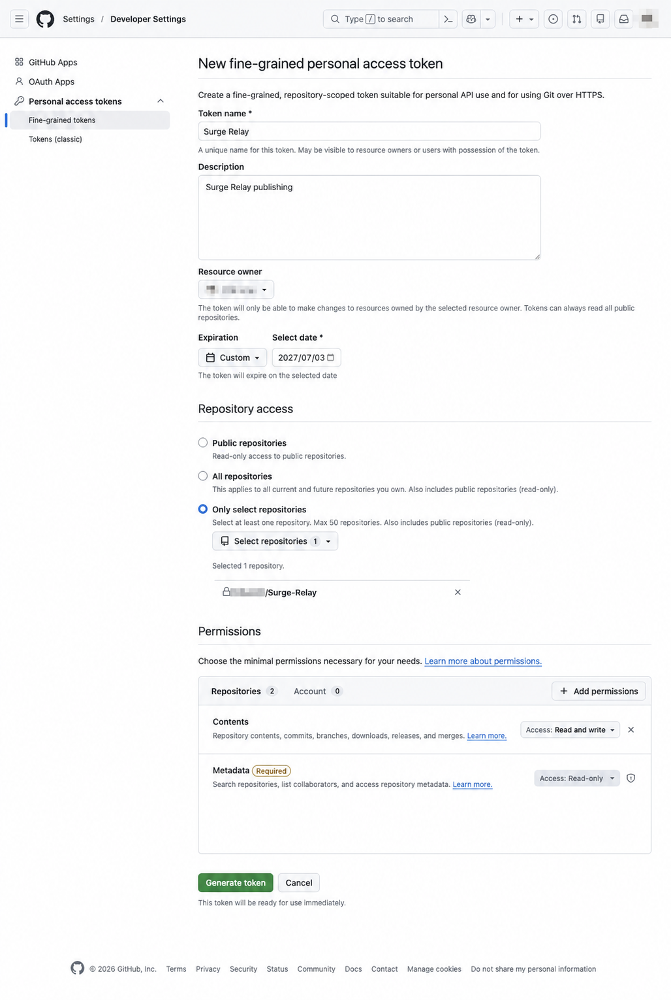
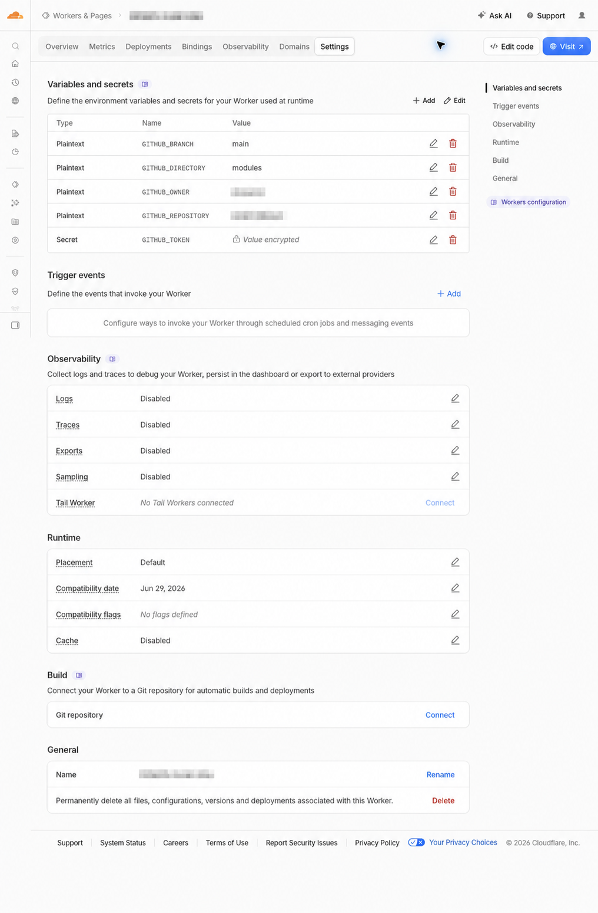

# 使用 GitHub 私有仓库与 Cloudflare Worker

这份教程面向第一次接触 GitHub 与 Cloudflare 的用户。完成后，Surge Relay 会把生成的模块写入你的 **GitHub 私有仓库**，再由 **Cloudflare Worker** 提供一个不暴露 GitHub Token 的稳定订阅地址。

> 整个过程大约需要 10–15 分钟。GitHub 与 Cloudflare 的界面文字可能随版本略有变化，但设置名称和逻辑不变。你可以使用 AI 工具，例如 Claude Code 或 Codex 进行一键部署。如果你觉得操作过于繁琐，建议直接使用 iCloud 同步模式 (最推荐🌟)。


## 快捷操作入口

以下页面可以直接打开。建议按表格顺序操作，并把本教程保留在另一个浏览器标签页中。

| 要完成的操作 | 直接打开 |
| --- | --- |
| 创建 GitHub 私有仓库 | [打开已预填名称和私有可见性的建仓页面](https://github.com/new?name=Surge-Relay&description=Surge+Relay+private+module+storage&visibility=private) |
| 创建 App 使用的可写 Token | [打开已预填 `Contents: write` 的 Token 页面](https://github.com/settings/personal-access-tokens/new?name=Surge+Relay&description=Surge+Relay+publishing&expires_in=365&contents=write) |
| 创建 Worker 使用的只读 Token | [打开已预填 `Contents: read` 的 Token 页面](https://github.com/settings/personal-access-tokens/new?name=Surge+Relay+Worker&description=Cloudflare+Worker+read-only&expires_in=365&contents=read) |
| 创建或管理 Cloudflare Worker | [打开 Cloudflare Workers & Pages](https://dash.cloudflare.com/?to=/:account/workers-and-pages) |
| 获取最新 Worker 代码 | [打开 Worker 源码](https://github.com/EEliberto/SurgeRelay-macOS/blob/main/Deployment/CloudflareWorker/src/index.js) |

## 开始前需要准备

- 一个 [GitHub 账号](https://github.com/signup)
- 一个 [Cloudflare 账号](https://dash.cloudflare.com/sign-up/workers-and-pages)
- 已安装 Surge Relay 的 Mac
- 记事本或密码管理器，用于临时保存两枚 Token

为了安全，教程会创建两枚权限不同的 Token：

| Token | 放在哪里 | 最小权限 |
| --- | --- | --- |
| Surge Relay Token | Surge Relay App | `Contents: Read and write` |
| Cloudflare Worker Token | Cloudflare Worker 的 Secret | `Contents: Read-only` |

两枚 Token 都只允许访问你新建的一个私有仓库。不要把 Token 发给别人、贴到 Issue，或直接写进 Worker 代码。

## 第一步：创建 GitHub 私有仓库

👉 [立即打开 GitHub 新建仓库页面](https://github.com/new?name=Surge-Relay&description=Surge+Relay+private+module+storage&visibility=private)

1. 登录 GitHub，打开 [新建仓库](https://github.com/new)。
2. `Repository name` 填写 `Surge-Relay`。名称可以不同，但后续必须保持一致。
3. 可见性选择 **Private**。
4. 勾选 **Add a README file**。这一步会创建 `main` 分支；空仓库无法通过 Surge Relay 完成首次发布。
5. 点击 **Create repository**。


创建后，复制浏览器地址栏中的仓库地址，例如：

```text
https://github.com/your-name/Surge-Relay
```

> Surge Relay 会拒绝公开仓库。请确认仓库标题旁显示 `Private`。

## 第二步：创建 Surge Relay 使用的可写 Token

👉 [立即打开已预填名称和 `Contents: write` 的 Token 页面](https://github.com/settings/personal-access-tokens/new?name=Surge+Relay&description=Surge+Relay+publishing&expires_in=365&contents=write)

1. 打开 GitHub 的 [Fine-grained personal access tokens](https://github.com/settings/personal-access-tokens)。
2. 点击 **Generate new token**。
3. `Token name` 填写 `Surge Relay`。
4. `Expiration` 建议选择一个你能记住的期限；到期后需要重新创建并在 App 中替换。
5. `Resource owner` 选择刚才创建仓库的账号。
6. `Repository access` 选择 **Only select repositories**，只勾选 `Surge-Relay`。
7. 展开 `Repository permissions`，把 **Contents** 设置为 **Read and write**；其他权限保持默认。
8. 点击 **Generate token**，立即复制生成的 Token。



Token 通常以 `github_pat_` 开头。GitHub 只会完整显示一次；如果丢失，请删除旧 Token 后重新创建。

## 第三步：创建 Cloudflare Worker 使用的只读 Token

👉 [立即打开已预填名称和 `Contents: read` 的 Token 页面](https://github.com/settings/personal-access-tokens/new?name=Surge+Relay+Worker&description=Cloudflare+Worker+read-only&expires_in=365&contents=read)

再次创建一枚 Fine-grained Token，设置基本相同，但有两处不同：

- `Token name` 填写 `Surge Relay Worker`
- `Repository permissions` → **Contents** 选择 **Read-only**

这枚 Token 仅用于 Cloudflare 从私有仓库读取模块，即使意外泄露，也不能修改仓库内容。

## 第四步：创建 Cloudflare Worker

👉 [立即打开 Cloudflare Workers & Pages](https://dash.cloudflare.com/?to=/:account/workers-and-pages)

1. 登录 [Cloudflare 控制台](https://dash.cloudflare.com/)。
2. 进入 **Workers & Pages**，选择 **Create application**。
3. 创建一个基础 Worker，名称可填写 `surge-relay`。
4. 首次部署后进入 Worker，打开代码编辑器（界面中可能显示为 `Edit code`）。
5. 删除示例代码，粘贴下面的完整代码，然后点击 **Deploy**。

<details>
<summary><strong>点击展开并复制 Worker 完整代码</strong></summary>

```js
const githubHeaders = (token) => ({
  Accept: "application/vnd.github.raw+json",
  Authorization: `Bearer ${token}`,
  "User-Agent": "Surge-Relay-Worker/1.0",
  "X-GitHub-Api-Version": "2022-11-28",
});

const encodePath = (path) => path
  .split("/")
  .filter(Boolean)
  .map(encodeURIComponent)
  .join("/");

export default {
  async fetch(request, env) {
    if (request.method !== "GET" && request.method !== "HEAD") {
      return new Response("Method Not Allowed", {
        status: 405,
        headers: { Allow: "GET, HEAD" },
      });
    }

    const url = new URL(request.url);
    let requestedPath;
    try {
      requestedPath = decodeURIComponent(url.pathname).replace(/^\/+/, "");
    } catch {
      return new Response("Bad Request", { status: 400 });
    }

    if (!requestedPath) {
      return Response.json({ service: "Surge Relay", status: "ok" }, {
        headers: { "Cache-Control": "no-store" },
      });
    }

    const isModule = requestedPath.endsWith(".sgmodule");
    const isGeneratedAsset = requestedPath.startsWith("assets/")
      && requestedPath.endsWith(".js");
    if (requestedPath.includes("..") || (!isModule && !isGeneratedAsset)) {
      return new Response("Not Found", { status: 404 });
    }

    if (!env.GITHUB_TOKEN) {
      return new Response("Worker is not configured", { status: 503 });
    }

    const repositoryPath = encodePath(`${env.GITHUB_DIRECTORY}/${requestedPath}`);
    const branch = encodeURIComponent(env.GITHUB_BRANCH || "main");
    const apiURL = `https://api.github.com/repos/${encodeURIComponent(env.GITHUB_OWNER)}/${encodeURIComponent(env.GITHUB_REPOSITORY)}/contents/${repositoryPath}?ref=${branch}`;
    const upstream = await fetch(apiURL, {
      headers: githubHeaders(env.GITHUB_TOKEN),
    });

    if (!upstream.ok) {
      return new Response(upstream.status === 404 ? "Not Found" : "GitHub upstream error", {
        status: upstream.status,
        headers: { "Cache-Control": "no-store" },
      });
    }

    const headers = new Headers(upstream.headers);
    headers.set("Access-Control-Allow-Origin", "*");
    headers.set("Cache-Control", "public, max-age=60, stale-while-revalidate=300");
    headers.set("Content-Type", isModule
      ? "text/plain; charset=utf-8"
      : "application/javascript; charset=utf-8");
    headers.delete("Authorization");
    headers.delete("Set-Cookie");

    return new Response(request.method === "HEAD" ? null : upstream.body, {
      status: 200,
      headers,
    });
  },
};
```

</details>

最新代码也可以在项目的 [`Deployment/CloudflareWorker/src/index.js`](../Deployment/CloudflareWorker/src/index.js) 中找到；如果只需要复制代码，可以直接[打开 Worker 源码页面](https://github.com/EEliberto/SurgeRelay-macOS/blob/main/Deployment/CloudflareWorker/src/index.js)。

## 第五步：配置 Worker 变量与 Secret

👉 [返回 Cloudflare Workers & Pages](https://dash.cloudflare.com/?to=/:account/workers-and-pages)，选择刚刚创建的 Worker。

在 Cloudflare Worker 中打开 **Settings** → **Variables and Secrets**，添加以下内容：

| 类型 | 名称 | 示例值 |
| --- | --- | --- |
| Text | `GITHUB_OWNER` | `your-name` |
| Text | `GITHUB_REPOSITORY` | `Surge-Relay` |
| Text | `GITHUB_BRANCH` | `main` |
| Text | `GITHUB_DIRECTORY` | `modules` |
| **Secret** | `GITHUB_TOKEN` | 第三步创建的只读 Token |

`GITHUB_OWNER` 是 GitHub 用户名，不是邮箱或昵称。`GITHUB_TOKEN` 必须选择 **Secret** 类型。



添加完成后点击 **Deploy**。Cloudflare 会提供一个类似下面的公共地址：

```text
https://surge-relay.your-subdomain.workers.dev
```

在浏览器打开这个地址。如果看到以下内容，说明 Worker 已运行：

```json
{"service":"Surge Relay","status":"ok"}
```

此时访问 `/Surge-Relay.sgmodule` 返回 `Not Found` 是正常的，因为 App 还没有首次发布模块。

## 第六步：在 Surge Relay 中完成设置

这一部分在 Mac 上操作，无需打开网页。请保留前面复制的 GitHub 仓库地址、App Token 和 Cloudflare `workers.dev` 地址。

1. 打开 Surge Relay → 菜单栏 **Surge Relay** → **设置…**。
2. 在左侧选择 **同步**。
3. 同步方式选择 **GitHub 私有仓库**。
4. `仓库地址` 填写第一步复制的完整 GitHub 地址。
5. `GitHub Token` 填写第二步创建的可写 Token。
6. `公共地址` 填写 Cloudflare 提供的 `workers.dev` 地址，不要在末尾添加文件名。
7. 点击 **验证并切换到 GitHub**。


验证过程中，Surge Relay 会依次确认：

1. 仓库存在且为私有仓库。
2. App Token 具有写入权限。
3. Worker 公共地址可以访问。
4. 实际发布一份汇总模块，并确认 Worker 能正确返回它。

看到“GitHub 与 Cloudflare 已验证”后即设置完成。最终汇总模块地址为：

```text
https://你的-worker-地址/Surge-Relay.sgmodule
```

## 常见问题

### 提示仓库不是私有仓库

打开 GitHub 仓库 → **Settings** → 页面底部 **Danger Zone**，确认仓库可见性为 `Private`。Surge Relay 不允许使用公开仓库存储配置。

### 提示 401 或 403

- 确认 App 中使用的是 `Contents: Read and write` Token。
- 确认 Worker 中使用的是 `Contents: Read-only` Token。
- 两枚 Token 的 `Repository access` 都必须包含当前私有仓库。
- 如果 Token 已过期，请重新创建并替换。

### 提示 404 或找不到 `main`

确认创建仓库时已经添加 README，且默认分支名称为 `main`。如果仓库仍为空，请在 GitHub 网页中新建一个 README 文件。

### Worker 首页显示 `Worker is not configured`

Cloudflare 中缺少 `GITHUB_TOKEN` Secret。添加后必须再次点击 **Deploy**。

### Worker 首页正常，但模块地址显示 `Not Found`

首次配置前这是正常现象。完成 Surge Relay 中的“验证并切换到 GitHub”后再次访问。如果仍然失败，请检查四个 Worker 文本变量是否与仓库一致。

### 提示 429 或 GitHub 请求过多

等待片刻后重试，并确认没有多台 Mac 在短时间内重复发布。新版 Surge Relay 已合并仓库查询并自动退避重试，以减少触发 GitHub 限流的概率。

### 更换或删除 Token

先创建新 Token，并分别在 Surge Relay 与 Cloudflare 中替换、验证成功，再删除旧 Token。不要先删除仍在使用的 Token。

## 安全检查清单

- [ ] GitHub 仓库显示 `Private`
- [ ] App Token 只选择一个仓库，权限为 `Contents: Read and write`
- [ ] Worker Token 只选择一个仓库，权限为 `Contents: Read-only`
- [ ] `GITHUB_TOKEN` 在 Cloudflare 中保存为 Secret
- [ ] Worker 源码、README、截图和 Issue 中都没有 Token
- [ ] 为 Token 设置到期时间，并在到期前更换

## 官方参考

- [GitHub：创建仓库](https://docs.github.com/zh/repositories/creating-and-managing-repositories/creating-a-new-repository)
- [GitHub：管理 Fine-grained personal access token](https://docs.github.com/zh/authentication/keeping-your-account-and-data-secure/managing-your-personal-access-tokens)
- [Cloudflare：通过控制台创建 Worker](https://developers.cloudflare.com/workers/get-started/dashboard/)
- [Cloudflare：配置 Worker Secrets](https://developers.cloudflare.com/workers/configuration/secrets/)
